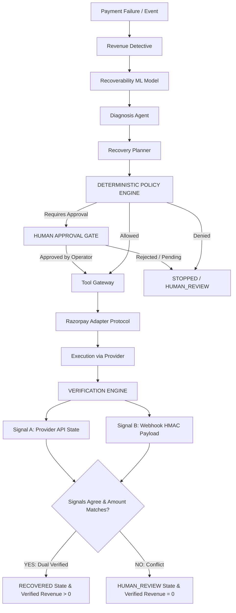

# RAY System Architecture

## 1. Core Architectural Principle

The central invariant of RAY is:

$$\text{PREDICTION} \neq \text{RECOMMENDATION} \neq \text{POLICY AUTHORIZATION} \neq \text{EXECUTION} \neq \text{INDEPENDENT VERIFICATION} \neq \text{VERIFIED REVENUE}$$

Every layer has a strictly bounded responsibility. Advisory components cannot authorize or execute; execution components cannot verify; only independent verification can mark revenue as recovered.

---

## 2. Conceptual Workflow Diagram

---

## 3. Subsystem Breakdown

### 3.1 Advisory Multi-Agent Layer
- **Revenue Detective:** Extracts features, queries ML model for $P(\text{recovery})$, computes expected recovery in Python `Decimal`.
- **Diagnosis Agent:** Identifies failure category (`TRANSIENT`, `TIMEOUT`, `BANK_UNAVAILABLE`, `PERMANENT`, `ABANDONMENT`, etc.) and structured evidence.
- **Recovery Planner:** Ranks candidate recovery strategies by Expected Value:
  $$EV = P(\text{success} \mid \text{action}) \times \text{amount} - \text{cost} - \text{penalty}$$
  Outputs an advisory proposal (does not authorize or execute).
- **Execution Agent:** Converts approved decisions into strongly-typed `ToolCallRequest` schemas for the Tool Gateway.

### 3.2 Deterministic Governance & Policy Engine
- Absolute authority over all recovery actions.
- Rules:
  - `MAX_RETRY_ATTEMPTS = 1`
  - Auto-retry ceiling: ₹10,000
  - High-value human gate: $\ge \text{₹}50,000$
  - Customer opt-outs strictly honored.
- Rejection or human gating cannot be overridden by any agent or prompt injection.

### 3.3 Tool Gateway & Idempotency
- Single entry point for financial execution.
- Canonical idempotency key: `ray:{case_id}:{strategy}:{attempt_number}`.
- Replays return cached results with zero duplicate provider calls.

### 3.4 Verification Engine & Cryptographic Evidence
- Requires two independent signals:
  1. API Polling: `status == 'captured'`
  2. Webhook: HMAC-SHA256 signature verification + event payload match
- Generates SHA-256 evidence hash from canonical JSON payload.
- In case of disagreement, case escalates to `HUMAN_REVIEW` with `verified_amount = 0.00`.
