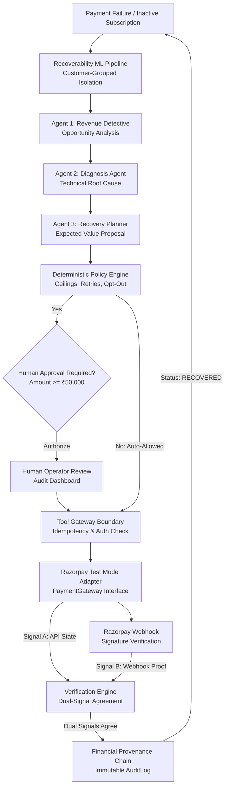

# RAY — Revenue Autonomy Engine: Architecture Specification

## 1. System Architecture

RAY functions as an **autonomous financial recovery control plane** for Razorpay merchants.
It is built upon a strict, non-negotiable architectural separation:

$$\mathbf{PREDICTION} \neq \mathbf{RECOMMENDATION} \neq \mathbf{AUTHORIZATION} \neq \mathbf{EXECUTION} \neq \mathbf{VERIFICATION}$$

---

## 2. Security Architecture Boundary

To guarantee that language models and autonomous agents never have unconstrained control over financial operations, RAY routes all external actions through a multi-tier containment boundary:

```mermaid
flowchart LR
    UNTRUSTED[Untrusted Customer Data<br/>notes, description, metadata] -->|PromptInjectionDefense| WRAPPED[Sanitized Data Boundary<br/>&lt;UNTRUSTED_DATA&gt;]
    
    WRAPPED --> AGENTS[Advisory LLM Agents<br/>Max 12 Steps Budget]
    
    AGENTS -->|Advisory Recommendation Only| POLICY[Deterministic Policy Engine<br/>Code-Level Ceilings & Rules]
    
    POLICY -->|Policy Decision ALLOW| GATEWAY[Tool Gateway Security Boundary<br/>Canonical Idempotency ray:case:strat:1]
    
    GATEWAY -->|Validated Execution Request| ADAPTER[PaymentGateway Interface<br/>Razorpay Test Mode Adapter]
    
    ADAPTER --> RAZORPAY_API[(Razorpay Infrastructure)]
```

### Security Guarantees:
1. **Zero Direct Provider Access**: Neither LLM agents, recovery planners, nor ML predictors have access to the Razorpay SDK or HTTP client. Only `ToolGateway` holds the `PaymentGateway` adapter reference.
2. **Prompt Injection Containment**: All merchant and customer-controllable inputs are strictly sanitized and enclosed within `<UNTRUSTED_DATA>` tags. Any injected system commands are parsed as passive data fields.
3. **Execution Guardrails**:
   - `HIGH_VALUE_THRESHOLD = ₹50,000`: Mandatory human operator authorization.
   - `AUTO_RETRY_MAX_AMOUNT = ₹25,000`: Hard automated retry ceiling.
   - `MAX_RETRY_ATTEMPTS = 1`: Prevents cardholder fatigue and payment gateway velocity blocks.
   - `CUSTOMER_OPT_OUT = DENY`: Respects customer communication preferences.

---

## 3. Financial Provenance & Dual-Signal Verification

```mermaid
sequenceDiagram
    autonumber
    actor Merchant as Customer / Checkout
    participant TG as Tool Gateway
    participant RZP as Razorpay Test Mode
    participant VE as Verification Engine
    participant DB as Audit & Provenance DB

    Merchant->>TG: Dispatches Authorized Recovery Action
    TG->>RZP: Dispatches retry / payment_link with Idempotency Key
    RZP-->>TG: Returns Provider Reference (e.g. pay_retry_abc123)
    TG->>DB: Stores ExecutionRecord (SHA-256 Response Hash)
    
    Note over VE: Dual-Signal Independent Verification
    VE->>RZP: Signal A: Polls GET /v1/payments/{id} -> status == 'captured'
    RZP-->>VE: Signal B: Webhook 'payment.captured' with HMAC-SHA256 signature
    
    rect rgb(20, 40, 20)
    Note over VE,DB: Signal Agreement Check
    VE->>VE: Evaluates: Signal A (captured) + Signal B (captured) == VERIFIED
    VE->>VE: Computes Canonical Evidence Hash = SHA256(payload)
    VE->>DB: Persists VerificationRecord & Updates Case -> RECOVERED
    end
```

