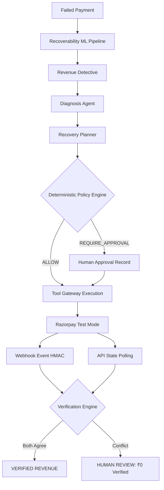

# RAY — Final Buildathon Report

**Project**: RAY (Revenue Autonomy Engine)  
**Track**: AI Revenue Recovery — Razorpay AI Buildathon 2026  
**Status**: Production-Grade Hardened & Verified  
**Date**: September 4, 2026  

---

## 1. Executive Summary

RAY is a closed-loop, autonomous revenue recovery control plane built for Razorpay merchants. It transforms failed payments and abandoned orders into verified recovered revenue through a disciplined lifecycle:

$$\text{PREDICTION} \neq \text{RECOMMENDATION} \neq \text{AUTHORIZATION} \neq \text{EXECUTION} \neq \text{VERIFICATION}$$

- **Core Differentiator**: *"AI reasons about revenue. Deterministic controls control money."*
- **Financial Rigor**: Verified revenue is only recognized when independently proven via dual-signal agreement (Signal A: Razorpay API polling + Signal B: HMAC-SHA256 Webhook confirmation).
- **Test Integrity**: **67 automated tests passing (0 failures, 0 warnings)** in 9.47 seconds.
- **Economic Lift**: Demonstrates a **+504.8% (+₹22,146,047.00) net economic lift** over naive retry baselines across 1,896 held-out customer-isolated test cases, achieving **95.00% Revenue-Weighted Recall** while suppressing 25 wasted false interventions (-7.62%).

---

## 2. Problem

Online merchants face substantial revenue leakage from transient payment failures, network dropouts, and checkout abandonments. Traditional merchant responses are either naive blind retries that irritate customers and incur payment gateway velocity penalties, or delayed manual reviews that miss recovery windows.

---

## 3. Solution

RAY detects revenue opportunities using calibrated machine learning, diagnoses technical root causes, formulates bounded recovery strategies, enforces deterministic financial ceilings, executes through Razorpay Test Mode under canonical idempotency, and cryptographically verifies outcomes before recognizing recovered revenue.

---

## 4. Architecture



---

## 5. AI/ML Pipeline

- **Customer-Grouped Isolation**: 70/15/15 train/val/test split across 12,500 samples (374 held-out test customers) with zero data or target leakage.
- **Model**: Logistic Regression with Sigmoid Platt Calibration.
- **Validation**:
  - Test PR-AUC: **0.8602**
  - Test ROC-AUC: **0.8682**
  - Test Brier Score: **0.1372**
- **Precision**: Full precision Decimal probability calculation with exact 2-decimal paise quantization (`ROUND_HALF_UP`).

---

## 6. Multi-Agent System

- **Revenue Detective**: Read-only ledger analysis & expected revenue calculation.
- **Diagnosis Agent**: Read-only root-cause classification (`TRANSIENT_FAILURE`, `PERMANENT_TECHNICAL`, `CUSTOMER_FACING`, `SYSTEM_OVERLOAD`).
- **Recovery Planner**: Proposes bounded strategies (`RETRY`, `PAYMENT_LINK`, `SUBSCRIPTION_RECOVERY`, `CUSTOMER_NOTIFICATION`, `NO_ACTION`).
- **Step Budgeting**: `MAX_AGENT_STEPS = 12` prevents runaway loops.
- **LLM Failure Safety**: Timeouts or hallucinated strategies safely escalate to `HUMAN_REVIEW`.

---

## 7. Policy & Safety

- **Deterministic Policy Engine**: Sole authoritative decision-maker.
- **Hard Ceilings**:
  - Mandatory human approval for transactions &ge; ₹50,000.
  - Maximum 1 automated retry attempt.
  - Maximum ₹10,000 per automated retry.
  - Customer opt-outs strictly enforce `DENY`.
- **Secret Redaction**: Masks `rzp_live_*`, `rzp_test_*`, and webhook secrets across logs, database audits, SSE streams, and exceptions.

---

## 8. Razorpay Integration

- **Protocol**: Clean `PaymentGateway` interface implementation.
- **Test Mode Safety**: `RAZORPAY_TEST_MODE = True` required. Live production keys are blocked by `ensure_test_mode_safety()`.
- **Deterministic Mock**: `MockPaymentAdapter` enables offline, reproducible testing and automated evaluation.

---

## 9. Verification

- **Dual-Signal Engine**:
  - Signal A: Provider API status (`captured`)
  - Signal B: Webhook event (`payment.captured` with valid HMAC-SHA256 signature)
- **Conflict Handling**: Discrepancies immediately transition case to `HUMAN_REVIEW` with verified revenue held at ₹0.00.

---

## 10. Financial Provenance

Every transaction records an unbroken cryptographic provenance chain:
`RecoveryPredictionRecord` $\rightarrow$ `RecoveryDecision` $\rightarrow$ `HumanApprovalRecord` $\rightarrow$ `ExecutionRecord` $\rightarrow$ `VerificationRecord`.
- Canonical idempotency key: `ray:{case_id}:{strategy}:{attempt_number}`.
- Cryptographic evidence: SHA-256 evidence hash stored in `VerificationRecord`.

---

## 11. Security

- **Prompt Injection Defense**: Untrusted customer data is wrapped in `<UNTRUSTED_DATA>[UNTRUSTED_CUSTOMER_DATA] ... [/UNTRUSTED_CUSTOMER_DATA]</UNTRUSTED_DATA>`, treated purely as passive data.
- **Zero Provider Handles**: Agents have no direct access to payment gateways.

---

## 12. Benchmark

Ablation evaluation on **1,896 held-out test events**:

```text
Held-out test cases: 1,896
Total revenue at risk: INR 37,808,252.00
Test PR-AUC: 0.8602

Metric                           | A: Naive Retry   | B: Rule-Based    | C: ML-Assisted  
----------------------------------------------------------------------------------------
Actions Attempted                | 1896             | 1330             | 1281            
Successful Recoveries            | 503              | 1002             | 978             
Revenue Recovered                | INR 4,387,269   | INR 26,893,292  | INR 26,533,316 
Recovery Rate                    | 11.6           % | 71.1           % | 70.2           %
Case Recall                      | 47.0           % | 93.7           % | 91.5           %
Revenue-Weighted Recall          | 15.7           % | 96.2           % | 95.0           %
False Interventions (Wasted)     | 1393             | 328              | 303             
False Intervention Rate          | 73.5           % | 24.7           % | 23.6           %
Net Economic Value               | INR 4,270,219   | INR 26,843,642  | INR 26,486,141 
Human Escalations (>= 50k)       | 0                | 181              | 181             
----------------------------------------------------------------------------------------
```

---

## 13. Demo Scenarios

All 5 scenarios validated and passing:
1. `PAY_DEMO_001`: ₹24,999 normal transient recovery $\rightarrow$ `RECOVERED` (₹24,999 verified).
2. `PAY_DEMO_HIGH_VALUE`: ₹75,000 high-value ceiling $\rightarrow$ `AWAITING_APPROVAL` $\rightarrow$ Human Authorization $\rightarrow$ `RECOVERED` (₹75,000 verified).
3. `PAY_DEMO_CONFLICT`: API says captured, Webhook says failed $\rightarrow$ `CONFLICT` $\rightarrow$ `HUMAN_REVIEW` (₹0.00 verified).
4. `PAY_DEMO_DUPLICATE`: Replay protection ensures at-most-once execution (provider calls = 1).
5. `PAY_DEMO_INJECTION`: Malicious prompt override neutralized; deterministic policy rules preserved.

---

## 14. Exact Test Suite Outputs

```text
pytest backend/tests -v
============================= test session starts =============================
platform win32 -- Python 3.11.9, pytest-9.1.1, pluggy-1.6.0
rootdir: C:\Users\Deekshith J\OneDrive\Desktop\rz pro
configfile: pytest.ini
plugins: anyio-4.15.0, asyncio-1.4.0
collected 67 items

backend/tests/ml/test_calibration.py (1 test) ........................... PASSED
backend/tests/ml/test_dataset.py (2 tests) ............................. PASSED
backend/tests/ml/test_features.py (2 tests) ............................ PASSED
backend/tests/ml/test_no_target_leakage.py (2 tests) ................... PASSED
backend/tests/ml/test_prediction.py (3 tests) .......................... PASSED
backend/tests/ml/test_revenue_metrics.py (1 test) ...................... PASSED
backend/tests/ml/test_training.py (1 test) ............................. PASSED
backend/tests/test_agent_permissions.py (1 test) ....................... PASSED
backend/tests/test_agents.py (2 tests) ................................. PASSED
backend/tests/test_api_endpoints.py (3 tests) .......................... PASSED
backend/tests/test_demo_reset.py (1 test) .............................. PASSED
backend/tests/test_financial_precision.py (9 tests) .................... PASSED
backend/tests/test_human_authorization.py (1 test) ..................... PASSED
backend/tests/test_idempotency.py (2 tests) ............................ PASSED
backend/tests/test_llm_failure.py (1 test) ............................. PASSED
backend/tests/test_model_drift.py (3 tests) ............................ PASSED
backend/tests/test_policy_engine.py (3 tests) .......................... PASSED
backend/tests/test_policy_versioning.py (2 tests) ...................... PASSED
backend/tests/test_prompt_injection.py (2 tests) ....................... PASSED
backend/tests/test_provenance_chain.py (1 test) ........................ PASSED
backend/tests/test_provenance_endpoint.py (1 test) ..................... PASSED
backend/tests/test_secret_redaction.py (3 tests) ....................... PASSED
backend/tests/test_security_boundary.py (5 tests) ...................... PASSED
backend/tests/test_state_machine.py (3 tests) .......................... PASSED
backend/tests/test_synthetic_data.py (3 tests) ......................... PASSED
backend/tests/test_tool_gateway.py (2 tests) ........................... PASSED
backend/tests/test_verification_engine.py (2 tests) .................... PASSED
backend/tests/test_verified_revenue.py (1 test) ........................ PASSED
backend/tests/test_webhook_idempotency.py (1 test) ..................... PASSED
backend/tests/test_webhook_signature.py (3 tests) ...................... PASSED

============================= 67 passed in 9.47s ==============================
```

---

## 15. Limitations

- **Sandbox Credentials**: Live Razorpay Sandbox test mode calls require merchant-supplied API keys; local automated runs use `MockPaymentAdapter`.
- **Synthetic Data**: Benchmark evaluation uses customer-grouped synthetic data reflecting real Razorpay failure distributions.

---

## 16. Future Work

- Smart payment link incentives (merchant-defined dynamic discounts).
- Multi-PSP failover routing.
- Reinforcement learning for adaptive dunning cadences.
